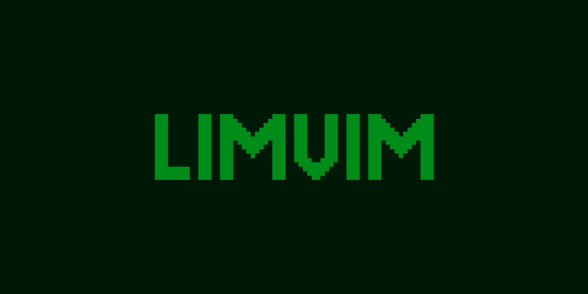
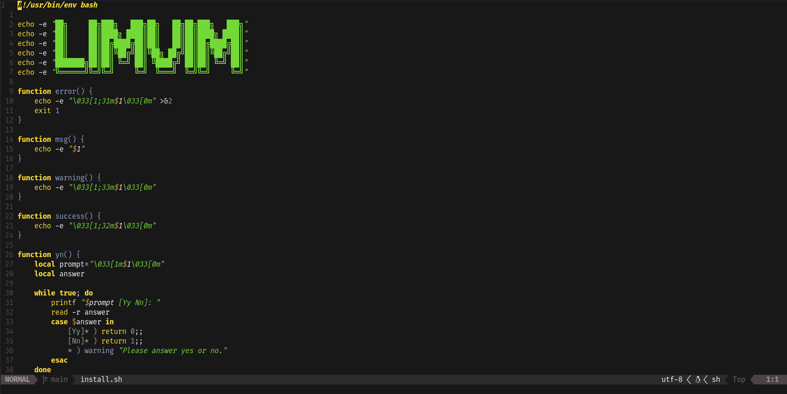

# 💚 Neovim Config

My personal Neovim configuration using Lua.  

---

## 🎨 Features

- **Colorscheme**: Gruber 💛  
- **Fuzzy Finder**: `telescope.nvim` with custom keybindings 🔍 
- **Git Integration**: `lazygit` built-in 🧩  
- **LSP Support**: Preconfigured for multiple languages 🖥️  
- **Status Line**: `lualine.nvim` for a modern status bar ⚡  

---

## ⚡ Installation

1. Backup your existing config (optional)
2. Run install.sh

```bash
  ./install.sh
```




